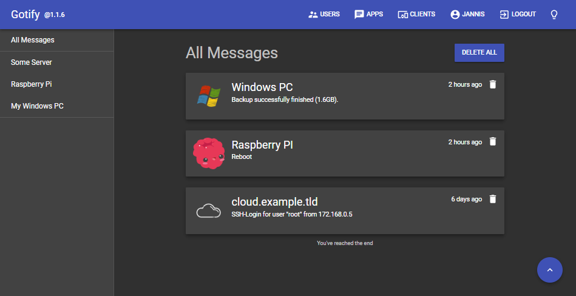

<!--
N.B.: This README was automatically generated by https://github.com/YunoHost/apps/tree/master/tools/README-generator
It shall NOT be edited by hand.
-->

# Gotify for YunoHost

[](https://dash.yunohost.org/appci/app/gotify)    
[](https://install-app.yunohost.org/?app=gotify)

*[Lire ce readme en français.](./README_fr.md)*

> *This package allows you to install Gotify quickly and simply on a YunoHost server.
If you don't have YunoHost, please consult [the guide](https://yunohost.org/#/install) to learn how to install it.*

## Overview

Gotify is a simple server for sending and receiving messages in real-time per web socket. (Includes a sleek web-ui)


**Shipped version:** 2.1.4~ynh2


## Screenshots



## Disclaimers / important information

## Configuration

How to configure this app:
> Edit `config.yml` file via SSH.

## Documentation and resources

* Official app website: <http://gotify.net>
* Official admin documentation: <https://gotify.net/docs/index>
* Upstream app code repository: <https://github.com/gotify/server>
* YunoHost documentation for this app: <https://yunohost.org/app_gotify>
* Report a bug: <https://github.com/YunoHost-Apps/gotify_ynh/issues>

## Developer info

Please send your pull request to the [testing branch](https://github.com/YunoHost-Apps/gotify_ynh/tree/testing).

To try the testing branch, please proceed like that.

``` bash
sudo yunohost app install https://github.com/YunoHost-Apps/gotify_ynh/tree/testing --debug
or
sudo yunohost app upgrade gotify -u https://github.com/YunoHost-Apps/gotify_ynh/tree/testing --debug
```

**More info regarding app packaging:** <https://yunohost.org/packaging_apps>
