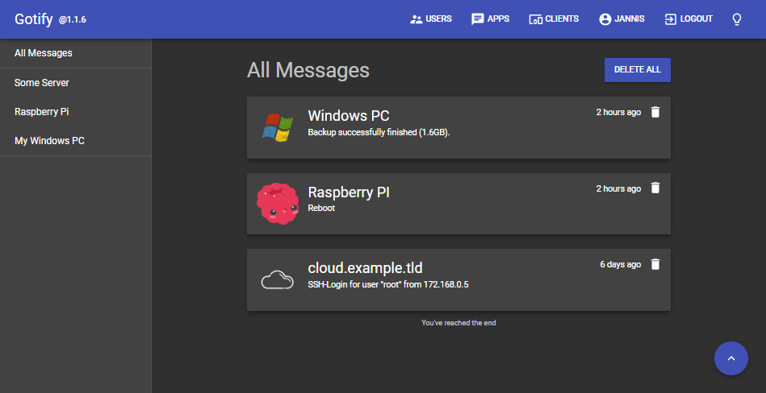

<!--
N.B.: Questo README è stato automaticamente generato da <https://github.com/YunoHost/apps/tree/master/tools/readme_generator>
NON DEVE essere modificato manualmente.
-->

# Gotify per YunoHost

[](https://dash.yunohost.org/appci/app/gotify)  

[](https://install-app.yunohost.org/?app=gotify)

*[Leggi questo README in altre lingue.](./ALL_README.md)*

> *Questo pacchetto ti permette di installare Gotify su un server YunoHost in modo semplice e veloce.*  
> *Se non hai YunoHost, consulta [la guida](https://yunohost.org/install) per imparare a installarlo.*

## Panoramica

Gotify is a simple server for sending and receiving messages in real-time per web socket.


**Versione pubblicata:** 2.4.0~ynh2

## Screenshot



## Documentazione e risorse

- Sito web ufficiale dell’app: <http://gotify.net>
- Documentazione ufficiale per gli amministratori: <https://gotify.net/docs/index>
- Repository upstream del codice dell’app: <https://github.com/gotify/server>
- Store di YunoHost: <https://apps.yunohost.org/app/gotify>
- Segnala un problema: <https://github.com/YunoHost-Apps/gotify_ynh/issues>

## Informazioni per sviluppatori

Si prega di inviare la tua pull request alla [branch di `testing`](https://github.com/YunoHost-Apps/gotify_ynh/tree/testing).

Per provare la branch di `testing`, si prega di procedere in questo modo:

```bash
sudo yunohost app install https://github.com/YunoHost-Apps/gotify_ynh/tree/testing --debug
o
sudo yunohost app upgrade gotify -u https://github.com/YunoHost-Apps/gotify_ynh/tree/testing --debug
```

**Maggiori informazioni riguardo il pacchetto di quest’app:** <https://yunohost.org/packaging_apps>
